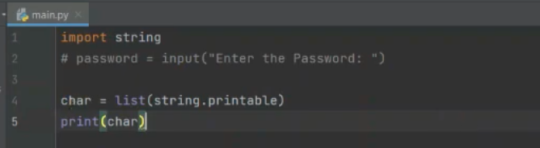
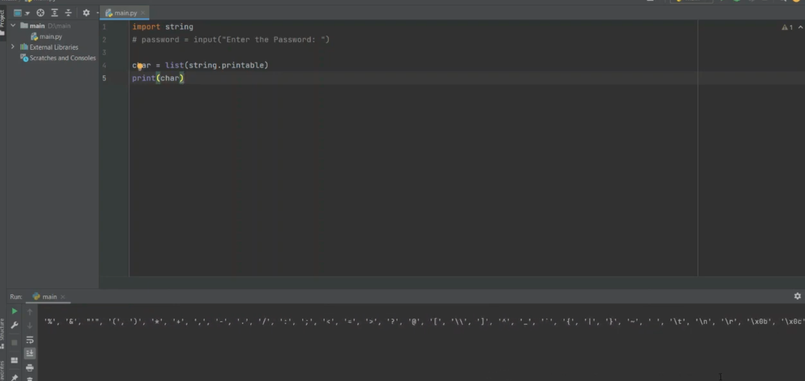
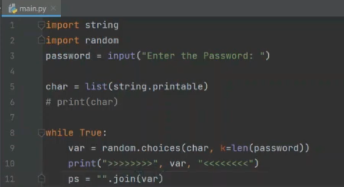
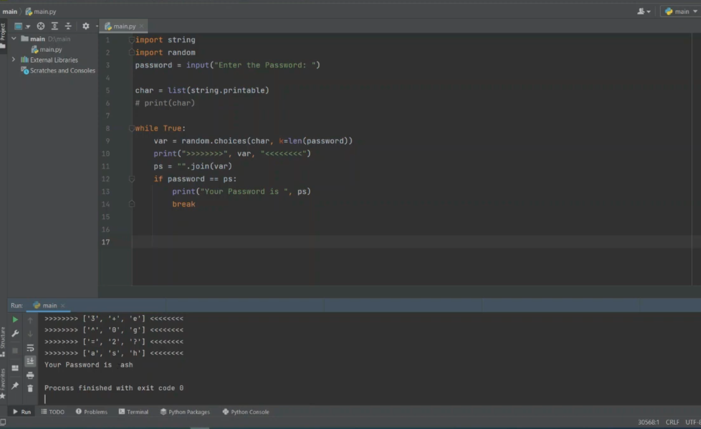

# Brute-force-password-cracker-python
Python script that demonstrates brute force password cracking for educational and cybersecurity awareness purposes.

# 🔐 Python Brute Force Password Cracker Lab

## 📌 Project Overview  
This project demonstrates how to build a Password Cracker using brute force techniques in Python. It is designed for **educational purposes only**, to better understand the logic behind brute force attacks and why securing passwords is critical in cybersecurity.

## 🛠️ Tools & Libraries Used  
- **Python Standard Library**  
- `string` – to generate a list of printable characters  
- `random` – to generate combinations of characters  
- `input()` – to take user input  

## 📚 What I Learned
- Basics of brute force logic and password cracking  
- Working with `string.printable` for character sets  
- Using loops and conditional logic (`while`, `if`)  
- Joining lists into strings using `"".join()`  
- Ethical considerations of offensive security tools  

## ⚠️ Security & Ethical Context
This lab was created only for educational use. Brute force tools must never be used without explicit permission from system owners. This is to understand how attackers might attempt to break passwords, so we can build stronger defenses.

## 🧪 Step-by-Step Lab Breakdown
### 1️⃣ Take Input from the User  
We start by letting the user enter the target password.

```python
password = input("Enter The Password: ")
```
### 2️⃣ Generate List of Characters  
Using the `string` library to pull all printable characters.

```python
import string
char = list(string.printable)
print(char)
```


### 3️⃣ Confirm Character Set  
After printing, you will see all uppercase and lowercase letters, digits, and special characters. This list will be used to generate password guesses.

### 🖼️ Visual Reference: Alphabet Characters  


### 4️⃣ Generate Random Passwords

```python
import random

var = random.choices(char, k=len(password))
print("Generated guess:", var)
```

### 5️⃣ Join Characters and Compare

```python
ps = "".join(var)
if ps == password:
    print("Your Password is", ps)
    break
```


### 6️⃣ Running the Cracker  
When you run the program, you'll see it trying many password combinations until it finds the correct one.  

🖼️ Image: ash

### 7️⃣ Testing with Special Characters  
We try a more complex password (e.g., @#1) to validate that our cracker can handle special characters as well.  
🖼️ Image: special_chars  
🖼️ Image: special_chars_cracked

### 🐞 Challenges & Fixes  
- Ensured `random.choices()` generated the correct password length  
- Properly joined the character list into a string  
- Added a break condition to stop once the password is cracked  
